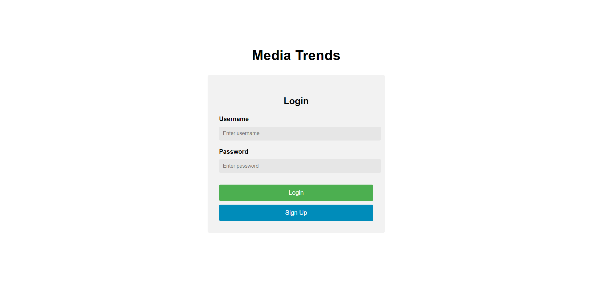
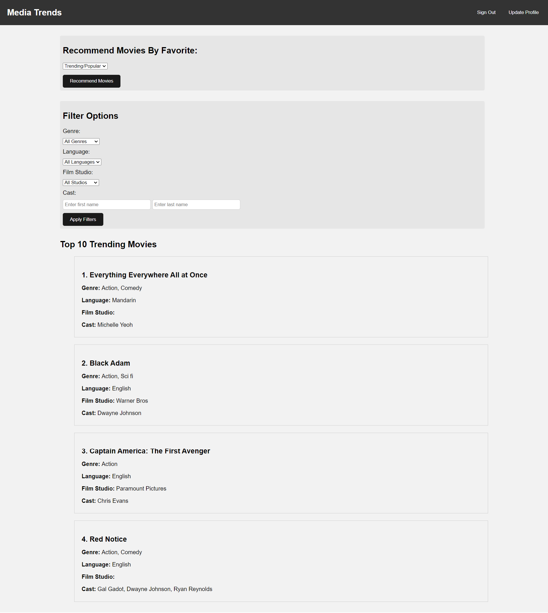
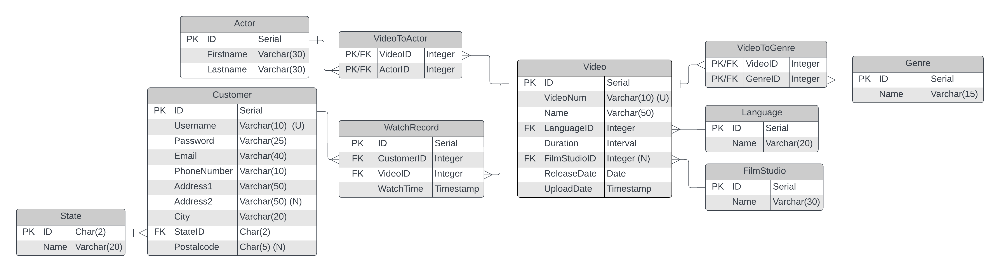

# MediaTrends
MediaTrends is a movie recommendation application that provides personalized recommendations based on a user's viewing history stored in a PostgreSQL database.

By default, the website displays the most popular and trending videos on the platform. Users can filter these recommendations by genre, language, film studios, and cast.

Customers can log in with their username and password to view recommended media based on their watch history. The algorithm takes into account the user's most viewed genre, language, film studios, and cast to provide personalized recommendations.

Screenshots of the application's login and main page:

Schema design:
